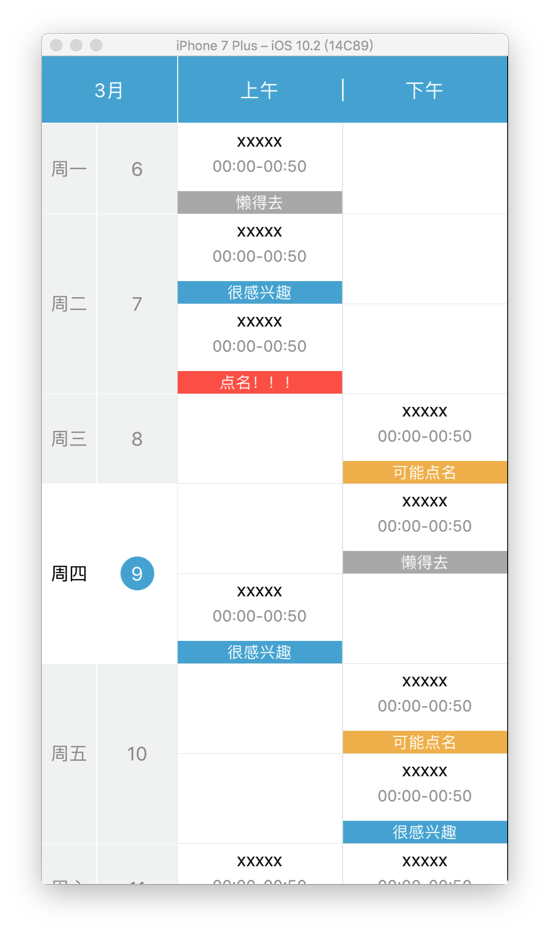

# HLLTimetable
📅一个针对于使用UICollectionView来实现课程表、行程单等效果的Layout布局

---

一个自定义的Layout，思路来自于**MSCollectionViewCalendarLayout**，可以很方便的实现一个课程表效果。

通过开源布局类[**MSCollectionViewCalendarLayout**](https://github.com/erichoracek/MSCollectionViewCalendarLayout)学习如何使用UICollectionView进行个性化视图的构建。

自定义布局的时候主要涉及Decoration、Supplementary、Cell这三种类型的视图，三者cell是必须要在进行布局的时候进行计算frame、zIndex的，前两者都是辅助性的视图类，一个装饰视图类、一个追加视图类。

在进行布局的时候有一些方法子类一定要hook，除了要对CollectionView的更新操作做布局约束，还要规定contentSize以及上面提到的三种类型视图的attributes。基本上该有的注释都在里面了。

下面是效果：

